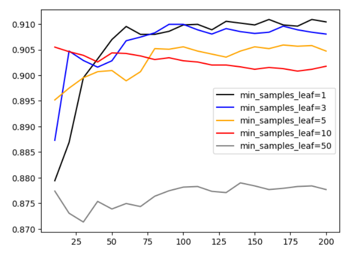
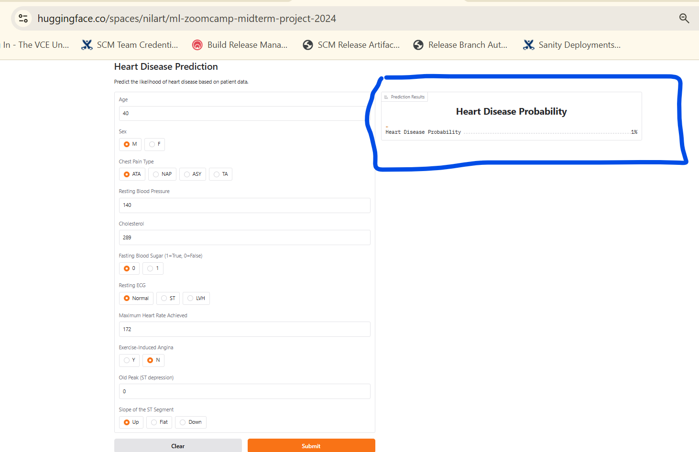

# ml-zoomcamp-midterm-project-2024
## Description
This is DataTalksClub ML zoomcamp midterm project repo. 

It uses dataset with person details like cholestrol level, BP, ECG status etc to predict heartdisease.

Dataset credit: https://www.kaggle.com/datasets/fedesoriano/heart-failure-prediction

Here are step by step details about how we build optimal model to predict heartdisease probability. 

## 1. Data preparation, cleanup and EDA
Code here: [notebook.ipynb](./notebook.ipynb)

Parse downloaded dataset [heart.csv](./heart.csv) via `pandas`.

Note: We are using local dataset copy here but we can download data from kaggle in notebook as well.
```python
kagglehub.dataset_download("fedesoriano/heart-failure-prediction")
```
Look for NAN values in data (There are none). 

Feature importance of rest features with our target variable: heartdisease:

We find mutual info for categorical features and correlation for numerical features.

Top 3 most relevant categorical fetatures are
```bash
st_slope          0.207474
chestpaintype     0.155988
exerciseangina    0.131680
```

Top 3 most relevant numerical fetatures are
```bash
oldpeak        0.403951
maxhr          0.400421
age            0.282039
```

## 2. Training a model
Code here: [notebook.ipynb](./notebook.ipynb)
### 2.1 One-hot encoding
Turn categorical data into binary vector
### 2.2 Simple Logistic regression
Train a simple logistic regression model.

Check AUC score for validation data.
### 2.3 Random forest regressor
Train random regression model.
Try different values of max_depth, n_estimators and min_samples_leaf.
Select values giving the best AUC score via graph.



### 2.4 XGBoost
Train random regression model.
Try different values of max_depth, eta and min_child_weight.
Select values giving the best AUC score.

### 2.5 Selecting the best model
Random forest model is giving slightly better results.
We also checked with test data.

## 3. Saving model
We train and save model with above optimal values.
Here is notebook [notebook_source_for_train_py.ipynb](./notebook_source_for_train_py.ipynb) 
 
Also converted to python script [train.py](./train.py) 
Running this script will save model in current directory as [rf.bin](./rf.bin)

## 4. Serving model locally via flask webservice
Run [predict.py](./predict.py) 

It will run prediction as websrive at url: http://localhost:9696/predict

We can test it by running [predict-test.py](./predict-test.py) 

Please use default values in script or change accordingly
```python
patient = {
    "age": 40,
    "sex": "M",
    "chestpaintype": "ATA",
    "restingbp": 140,
    "cholesterol": 289,
    "fastingbs": 0,
    "restingecg": "Normal",
    "maxhr": 172,
    "exerciseangina": "N",
    "oldpeak": 0.0,
    "st_slope": "Up",
}
```
It will give output like following:

{'heartdisease': False, 'heartdisease_probability': 0.007087624449502825}

No high probability of heartdisease for patient xyz-123

Or

{'heartdisease': True, 'heartdisease_probability': 0.6917056277056278}

High probability of heartdisease for patient xyz-456

## 5. Dependency and environment management
Here is the [Pipfile](./Pipfile) and [Pipfile.lock](./Pipfile.lock) file to manage dependencies like pandas, scikit-learn, gunicorn, flask

## 6. Cotainerization and Deploying via docker
Mainatain flask Webservice python file, Dependencies, Model etc all in self sufficient container: [Dockerfile](./Dockerfile)

Instructions to run:

Pull docker container from public docker image at github registry

```bash
docker pull ghcr.io/nilarte/heart_disease_prediction
```

Note: 
You will need docker login to ghcr.io

Please give your github username and personal access token to login


ex:
```bash
docker login ghcr.io -u Your_Username
```

Or simply build local image using Dockerfile
```bash
docker build -t heart_disease_prediction .
```

Then run:
```bash
docker run -d -p 9696:9696 ghcr.io/nilarte/heart_disease_prediction
```
It will run same prediction webservice in container

```bash
@nilarte ➜ /workspaces/ml-zoomcamp-midterm-project-2024 (main) $ docker ps
CONTAINER ID   IMAGE                                      COMMAND                  CREATED         STATUS         PORTS                                       NAMES
f5c7646761f8   ghcr.io/nilarte/heart_disease_prediction   "gunicorn --bind=0.0…"   2 minutes ago   Up 2 minutes   0.0.0.0:9696->9696/tcp, :::9696->9696/tcp   sweet_matsumoto
```
We can test it again by running [predict-test.py](./predict-test.py) 

## 7. Cloud deployment
We have deployed model on huggingface spaces as a `gradio` webservice.

Here is the app.py and requirements.txt file same as on huggingface: [app.py](./app.py) [requirements.txt](./requirements.txt)

Steps to use:

Connect to webservice here: https://huggingface.co/spaces/nilart/ml-zoomcamp-midterm-project-2024

Enter patient data and observe heartdisease probability.



Short demo can be downloaded and watched: [demo.mp4](./demo.mp4)
